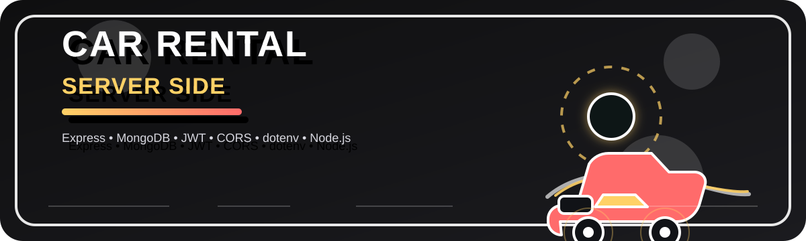

# Car Rental Server Side

<p align="center">
  
</p>

<p align="center">
  <strong>Express + MongoDB backend for a car rental platform</strong>
</p>

<p align="center">
  <a href="#features">Features</a> •
  <a href="#tech-stack">Tech Stack</a> •
  <a href="#setup">Setup</a> •
  <a href="#environment-variables">Environment Variables</a> •
  <a href="#api-routes">API Routes</a>
</p>

---

## Overview

Car Rental Server Side is the backend API for a car rental application. It handles cars, bookings, users, payments, reviews, recent items, admin data, and approved cars with MongoDB as the database.

The project is built with a lightweight Node.js + Express architecture and deployed through Vercel.

## Features

- REST API for car rental operations
- MongoDB collections for:
  - cars
  - bookings
  - users
  - payments
  - reviews
  - recent items
  - admins
  - approved cars
- JWT-based authentication
- Token blacklist logout flow
- Searchable car listings
- Booking management
- Admin update endpoints
- Vercel deployment support

## Tech Stack

This project uses the following technologies and packages:

- **Node.js**
- **Express 5**
- **MongoDB**
- **CORS**
- **dotenv**
- **jose-cjs** for JWT signing and verification
- **Vercel** for deployment

## Project Structure

```bash
.
├── index.js
├── package.json
├── package-lock.json
├── README.md
├── vercel.json
└── assets/
    └── readme-banner.svg
```

## Setup

### 1. Install dependencies

```bash
npm install
```

### 2. Create a `.env` file

Add the required environment variables:

```env
MONGODB_URI=your_mongodb_connection_string
PORT=5000
BASE_URL=https://your-auth-domain.com
JWT_SECRET=your_jwt_secret
```

### 3. Start the server

```bash
node index.js
```

By default, the server runs on:

```bash
http://localhost:5000
```

## Environment Variables

| Variable | Description |
| --- | --- |
| `MONGODB_URI` | MongoDB connection string |
| `PORT` | Server port |
| `BASE_URL` | Base URL used to build the JWKS endpoint |
| `JWT_SECRET` | Secret used to sign and verify JWTs |

## API Routes

### Health

- `GET /`  
  Returns a simple server status message.

### Cars

- `GET /cars`
- `GET /cars/:id`
- `POST /cars` _(protected)_
- `PUT /cars/:id` _(protected)_
- `DELETE /cars/:id` _(protected)_
- `PATCH /cars/:id` _(protected, increments booked user count in the current implementation)_
- `PATCH /update/:id` _(updates car data)_
- `GET /featured-cars`
- `GET /added-cars/:id`
- `GET /cars?search=...`

### Bookings

- `POST /booking`
- `GET /booking/:id`
- `GET /bookings`
- `GET /bookings/admin`
- `POST /bookings`
- `PATCH /bookings/:id`
- `DELETE /bookings/:id`

### Users

- `GET /users`
- `GET /users/:email`
- `POST /users`
- `POST /users/token`

### Reviews

- `GET /reviews`
- `POST /reviews`

### Payments

- `GET /payments`
- `POST /payments`

### Admin

- `GET /admin`
- `POST /admin`
- `PATCH /admin/:id`

## Authentication

This server uses JWT authentication with `jose-cjs`.

- Protected routes expect an `Authorization` header
- Logout is handled by blacklisting tokens in `blacklist.json`
- Tokens are generated for users through `/users/token`

## Deployment

The project includes Vercel configuration in `vercel.json`.

Deploying on Vercel should use:

- `index.js` as the server entry
- Node.js runtime via `@vercel/node`

## Notes

- MongoDB collections are created in the `carrental` database.
- Some routes return raw MongoDB results directly.
- The README banner is an SVG asset stored at `assets/readme-banner.svg`.

## License

MIT
